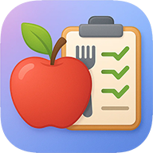

# 🍎 Calorie Counter PWA

A lightning-fast, modern Progressive Web App for tracking calories, macronutrients (fat, carbs, protein), and maintaining a healthy lifestyle. Built with cutting-edge web technologies and AI-powered food recognition.



## ✨ Features

### 🎯 Core Functionality
- **Multi-Nutrient Tracking**: Track calories, fat, carbohydrates, and protein
- **Tabbed Interface**: Easy switching between different macro views
- **Daily Goals**: Set and track personalized targets for each nutrient
- **Progress Visualization**: Beautiful progress bars and statistics

### 📱 Input Methods
- **Barcode Scanning**: Instant food recognition via camera
- **Voice Input**: Say what you ate, get instant calorie estimates
- **Text Input**: Type food descriptions for quick logging
- **Smart Editing**: Modify quantities with automatic macro recalculation

### 📊 Analytics & History
- **Interactive Charts**: Visualize nutrition trends over time
- **Tabbed History**: View charts for calories, fat, carbs, or protein
- **Statistics Cards**: Daily averages, totals, and peak values
- **Data Export**: Download your nutrition data as CSV

### 🚀 Progressive Web App
- **Offline Support**: Works without internet connection
- **Install Anywhere**: Add to home screen on any device
- **Fast Performance**: Optimized for speed and responsiveness
- **Cross-Platform**: Works on iOS, Android, Windows, macOS, Linux

### 🎨 User Experience
- **Dark Theme**: Beautiful, eye-friendly dark interface
- **Apple-Style Design**: Clean, modern aesthetics
- **Mobile-First**: Optimized for touch devices
- **Responsive**: Adapts to any screen size

## 🛠️ Technology Stack

### Frontend
- **Next.js 15** - React framework with App Router
- **TypeScript** - Type-safe development
- **Tailwind CSS** - Utility-first styling
- **Recharts** - Interactive data visualization

### Backend & APIs
- **OpenAI GPT** - AI-powered food recognition and nutrition analysis
- **Next.js API Routes** - Serverless backend functions

### Data & Storage
- **IndexedDB** - Local-first data storage
- **idb-keyval** - Simple IndexedDB wrapper
- **PWA Service Worker** - Offline caching and performance

### Development & Testing
- **Jest** - Unit testing framework
- **ESLint** - Code linting and quality
- **Fake IndexedDB** - Testing utilities

## 🚀 Quick Start

### Prerequisites
- Node.js 18+
- npm or yarn
- OpenAI API key

### Installation

1. **Clone the repository**
   ```bash
   git clone https://github.com/yourusername/caloriecounter.git
   cd caloriecounter
   ```

2. **Install dependencies**
   ```bash
   npm install
   ```

3. **Set up environment variables**
   ```bash
   cp .env.example .env.local
   ```

   **Get your OpenAI API key:**
   - Visit [OpenAI Platform](https://platform.openai.com/api-keys)
   - Create an account or sign in
   - Generate a new API key
   - Copy the key (starts with `sk-proj-...`)

   **Add your API key to `.env.local`:**
   ```bash
   OPENAI_API_KEY="sk-proj-your-actual-api-key-here"
   ```

   ⚠️ **Important**: Never commit your `.env.local` file to version control!

4. **Run development server**
   ```bash
   npm run dev
   ```

5. **Open in browser**
   Navigate to `http://localhost:3000`

### Building for Production

```bash
npm run build
npm start
```

## 📱 Installation as PWA

### Android (Chrome/Edge)
1. Open the app in Chrome or Edge
2. Tap the "Install" button in the custom banner
3. Or use browser menu → "Add to Home screen"

### iOS (Safari)
1. Open the app in Safari
2. Tap the Share button
3. Select "Add to Home Screen"

### Desktop
1. Open the app in Chrome, Edge, or Safari
2. Look for the install icon in the address bar
3. Click to install as a desktop app

## 🎯 Usage Guide

### Adding Food Entries
1. **Barcode Scanning**: Tap the barcode icon, scan product
2. **Voice Input**: Tap microphone, say what you ate
3. **Text Input**: Tap text icon, type food description

### Viewing Different Nutrients
- Use the tabs at the top of the main card
- Switch between Calories, Fat, Carbs, and Protein
- Each tab shows progress toward your daily goal

### Setting Goals
1. Go to Settings
2. Adjust daily targets for each nutrient
3. Goals are used for progress calculations

### Viewing History
1. Navigate to History page
2. Use tabs to switch between nutrient charts
3. View statistics and trends over time

### Exporting Data
1. Go to Settings
2. Tap "Download Data as CSV"
3. File includes: date, calories, carbs, fat, protein

## 🧪 Testing

Run the test suite:
```bash
npm test
```

Run tests in watch mode:
```bash
npm run test:watch
```

## 🔒 Security & Environment Variables

### API Key Security
- **Never commit API keys** to version control
- Use `.env.local` for local development (automatically ignored by Git)
- Use platform environment variables for production deployment
- The `.env` file in the repository contains only placeholder values

### Required Environment Variables
- `OPENAI_API_KEY`: Required for food recognition and nutrition analysis
- Other variables are optional and for future features

### Production Deployment
When deploying to platforms like Vercel, Netlify, or similar:
1. Add your `OPENAI_API_KEY` to the platform's environment variables
2. Never include real API keys in your deployment files

## 📁 Project Structure

```
src/
├── app/                 # Next.js App Router pages
├── components/          # Reusable UI components
├── hooks/              # Custom React hooks
├── types/              # TypeScript type definitions
├── utils/              # Utility functions and helpers
└── __tests__/          # Test files

public/
├── icons/              # PWA icons (various sizes)
├── manifest.json       # PWA manifest
└── LICENSE             # License file
```

## 🤝 Contributing

This project is currently not accepting external contributions. For commercial licensing or collaboration inquiries, please contact the author.

## 📄 License

This software is licensed under a custom non-commercial license. See the [LICENSE](LICENSE) file for complete terms and conditions.

**Key Points:**
- ✅ Free for personal, non-commercial use
- ✅ Study, modify, and host for personal use
- ❌ Commercial use requires permission
- ❌ Cannot remove attribution

For commercial licensing, contact: info@ai-created.com

## 📊 Data Sources

This app uses nutrition data sourced in part from USDA FoodData Central. FoodData Central data is public domain / CC0. USDA does not endorse this app.

> U.S. Department of Agriculture, Agricultural Research Service, Beltsville Human Nutrition Research Center. FoodData Central. Available from https://fdc.nal.usda.gov/.

See [ATTRIBUTION.md](ATTRIBUTION.md) for full details.

## 👨‍💻 Author

**Marco van Hylckama Vlieg**
- 🌐 Website: [ai-created.com](https://ai-created.com/)
- 📧 Email: info@ai-created.com
- 💼 Specializing in AI-powered web applications

## 🙏 Acknowledgments

- OpenAI for GPT API powering food recognition
- Next.js team for the excellent framework
- Tailwind CSS for the utility-first styling system
- Recharts for beautiful data visualization

---

**Copyright © 2025 Marco van Hylckama Vlieg**
Built with ❤️ using AI-assisted development
